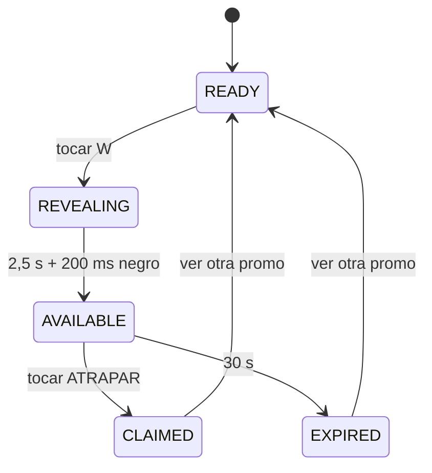

# Guía técnica de Promo Catch

Esta guía explica la demo publicada, su integración React–Rive y la frontera
entre la simulación frontend y una implementación de producción.

## 1. Resumen

La aplicación monta un artboard vertical de Rive dentro de React. La escena
incluye la paleta negro/blanco/verde, los targets táctiles, las animaciones y
los estados visuales. React administra el reloj de 30 segundos y escribe sus
resultados en el View Model enlazado a Rive.

| Parte | Responsabilidad |
| --- | --- |
| Rive / RML | Diseño, hit targets, revelación y estados visuales |
| `PromoViewModel` | Contrato de datos entre Rive y React |
| React | Carga, temporizador, error, responsive y reinicio exterior |
| Vite | Build estático y versionado del asset `.riv` |
| Playwright | QA de carga, geometría, privacidad e interacción |
| Vercel | Hosting y cabeceras `noindex` |

## 2. Flujo funcional



El contador empieza cuando termina la revelación. El CTA muestra
`ATRAPAR [30]` y desciende hasta cero. Un clic válido cambia `claimed`; si el
tiempo termina, React cambia `expired`.

## 3. Estructura relevante

```text
rive/promo-catch/scene.rml              fuente Rive legible y versionable
rive/promo-catch/rive.yaml              configuración de compilación
rive/promo-catch/Montserrat.ttf         fuente embebida
src/assets/wintap-promo-catch.riv       build consumido por la web
src/components/PromoCatchExperience.tsx integración del runtime
src/lib/riveConfig.ts                   nombres y dimensiones públicas
src/lib/useContainedSize.ts             cálculo responsive 390:844
```

El `.riv` se genera con la CLI oficial de Rive. El proyecto fuente permite
verificar, inspeccionar y reconstruir el asset sin depender de un binario
opaco.

## 4. Contrato React–Rive

El artboard `PromoScreen` ejecuta `PromoMachine` y se enlaza automáticamente a
`PromoViewModel` mediante `autoBind: true`.

| Propiedad | Tipo | Escritura principal | Uso |
| --- | --- | --- | --- |
| `started` | boolean | Listener de la W | Inicia revelación y reloj |
| `claimed` | boolean | Listener de ATRAPAR | Pasa a éxito |
| `expired` | boolean | React | Pasa a vencido al llegar a cero |
| `ctaLabel` | string | React | Renderiza el segundo actual en Rive |

Los controles visibles no son botones HTML superpuestos: los clics ocurren
dentro del canvas sobre shapes del archivo Rive. React solo observa/escribe el
View Model y no reconstruye la interfaz visual.

## 5. Temporización

La animación `REVEALING` dura 162 frames a 60 fps:

- frames 0–150: progreso y tensión visual (2,5 segundos);
- frames 151–162: negro absoluto (200 ms);
- al finalizar: estado `AVAILABLE` y activación del countdown.

`PromoCatchExperience` espera 2.700 ms después de `started` y crea un intervalo
de un segundo. Cada tick actualiza `ctaLabel`. `claimed` o `expired` limpian
todos los timers. El cleanup del efecto también los limpia al desmontar para
evitar callbacks sobre una instancia destruida.

## 6. Responsive

El artboard mantiene su relación `390 / 844`. `useContainedSize` observa el
contenedor y calcula el rectángulo más grande que cabe sin recorte ni
deformación. El runtime usa `Fit.Contain`, `Alignment.Center` y el device pixel
ratio para conservar nitidez.

## 7. Reinicio

Hay dos recorridos:

1. `VER OTRA PROMO`, dentro de Rive, vuelve a `READY` y restaura las propiedades;
2. `Reiniciar demo`, fuera del canvas, cambia una `key` de React y crea una
   instancia completamente nueva.

El segundo también recupera errores del runtime o del Error Boundary.

## 8. Qué demuestra y qué no

La demo demuestra:

- composición y animación en Rive;
- Data Binding con React;
- estados y temporización de la experiencia;
- responsive, carga/error y privacidad básica;
- una dirección visual alineada con el material público de WINTAP.

No implementa inventario, reserva real, pagos, canje ni antifraude. En
producción, el servidor debe decidir el ganador mediante una operación atómica,
auditable e idempotente; el frontend solo representa la respuesta.

## 9. Validación

```bash
npm run lint
npm run typecheck
npm run build
npm run test:privacy
npm run test:e2e
```

La fuente Rive debe verificarse además con:

```bash
rive rive/promo-catch --verify
rive inspect rive/promo-catch --summary
```

La inspección esperada contiene un artboard `PromoScreen`, una máquina
`PromoMachine`, cinco estados de animación, tres listeners y cero problemas.

## 10. Privacidad

La demo utiliza meta robots, `robots.txt` y `X-Robots-Tag` para evitar
indexación. Esto no es control de acceso: quien conoce la URL puede abrirla.
