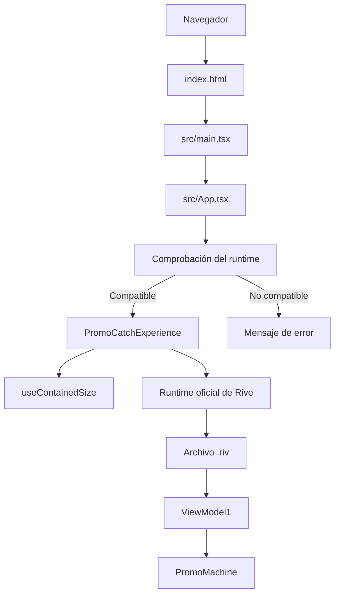
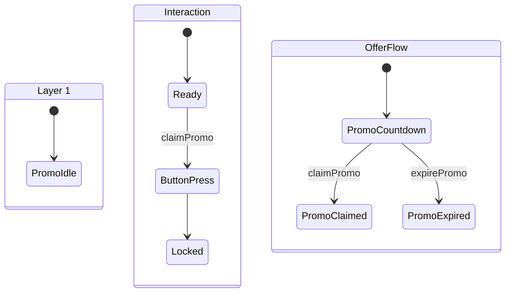
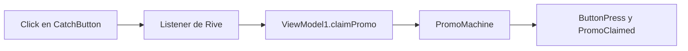

# Guía técnica de Promo Catch

Esta guía explica cómo está construida la demo, por qué se tomaron sus
decisiones principales y cómo recorrer el código sin necesidad de conocer de
antemano React, Rive o Vite.

## 1. Resumen en una frase

La aplicación es una página estática de React que calcula el espacio disponible,
monta dentro de él un archivo `.riv` mediante el runtime oficial y deja que Rive
controle el countdown, el clic y los estados finales de la promoción.

La separación de responsabilidades es la idea más importante del proyecto:

| Parte | Responsabilidad |
| --- | --- |
| Rive (`.riv`) | Diseño, animaciones, countdown, botón, listeners y estados de éxito/vencimiento |
| React | Estructura de la página, montaje de Rive, carga/error y reinicio |
| CSS | Presentación exterior y adaptación al viewport |
| Vite | Desarrollo local y generación del build estático |
| Playwright | QA automatizado de carga, geometría, privacidad y superficie clicable |
| Vercel | Publicación de los archivos estáticos y cabeceras HTTP |

React no recrea el botón ni duplica la lógica de la promoción. El usuario hace
clic directamente sobre el canvas de Rive.

## 2. Arquitectura general



Dentro de Rive, el recorrido funcional relevante es:



Las tres capas se ejecutan dentro de la misma State Machine y coordinan el idle,
el bloqueo del botón y el resultado de la oferta. React solo inicia
`PromoMachine`; las condiciones y transiciones pertenecen al archivo Rive.

## 3. Recorrido desde la URL hasta la animación

### Paso 1: el navegador recibe `index.html`

`index.html` contiene:

- el nodo `<div id="root">` donde React montará la aplicación;
- el enlace a `src/main.tsx` durante desarrollo, transformado por Vite en el
  build;
- el título y la descripción de la página;
- las directivas `noindex`, `nofollow`, `noarchive` y `nosnippet`;
- la configuración de viewport necesaria para móviles y safe areas.

### Paso 2: `src/main.tsx` crea la aplicación React

`createRoot` busca `#root` y renderiza `<App />`. Si ese elemento no existe, se
lanza un error temprano porque la aplicación no tendría dónde montarse.

`StrictMode` añade comprobaciones de desarrollo. No modifica el resultado del
build de producción, aunque en desarrollo puede ejecutar ciertos ciclos más de
una vez para detectar efectos inseguros.

### Paso 3: `src/App.tsx` construye la página

`App` contiene tres zonas:

1. encabezado y texto de contexto;
2. área principal donde vive la experiencia;
3. botón HTML `Reiniciar demo`.

Antes de montar Rive, `getRuntimeSupport()` comprueba que existan WebAssembly y
Canvas 2D. El runtime de Rive necesita ambas tecnologías. Si falta alguna, se
muestra un mensaje comprensible en lugar de intentar montar una experiencia que
no podrá funcionar.

### Paso 4: se calcula el rectángulo disponible

`PromoCatchExperience` obtiene el elemento `.stage` mediante un callback ref y
lo pasa a `useContainedSize`.

El artboard mide 390 × 844, por lo que su relación de aspecto es:

```text
390 / 844 ≈ 0,462
```

El hook compara esa relación con la del espacio disponible:

- si el contenedor es proporcionalmente más ancho, usa toda la altura y calcula
  la anchura;
- si es más estrecho, usa toda la anchura y calcula la altura.

En forma simplificada:

```text
contenedor ancho  -> width = availableHeight × ratio
contenedor angosto -> height = availableWidth / ratio
```

`ResizeObserver` repite el cálculo cuando cambia el tamaño real del contenedor.
El listener de `window.resize` sirve como respaldo ante un cambio de viewport.
El resultado conserva 390:844 sin recortes ni deformación.

### Paso 5: React monta el runtime de Rive

Cuando el tamaño ya es mayor que cero, `useRive` recibe esta configuración:

| Propiedad | Valor | Motivo |
| --- | --- | --- |
| `src` | Asset `.riv` importado por Vite | El archivo se incluye en el build con hash |
| `artboard` | `PromoScreen` | Selecciona el artboard aprobado |
| `stateMachine` | `PromoMachine` | Ejecuta la máquina de estados predeterminada |
| `autoplay` | `true` | Inicia la experiencia al terminar la carga |
| `autoBind` | `true` | Enlaza automáticamente la instancia de `ViewModel1` |
| `shouldDisableRiveListeners` | `false` | Mantiene activos los listeners nativos sobre el canvas |
| `Fit.Contain` | — | Conserva el artboard completo dentro del frame |
| `Alignment.Center` | — | Centra el contenido en el frame |

`useDevicePixelRatio: true` hace que el bitmap interno del canvas tenga en cuenta
la densidad de píxeles del dispositivo para conservar nitidez.

## 4. La decisión crítica: `autoBind: true`

El botón visible pertenece al archivo Rive. Su Listener `Click` ejecuta la
acción `set ./ claimPromo`.

`claimPromo` y `expirePromo` no son inputs clásicos de la State Machine. Son
propiedades de tipo trigger de `ViewModel1`. Por ese motivo, obtener los inputs
tradicionales de `PromoMachine` devuelve una lista vacía; no indica un error.

La relación real es:



`autoBind: true` indica al runtime que cree o enlace automáticamente la instancia
del View Model esperada por el artboard. Sin ese enlace:

- el `.riv` puede cargar;
- `PromoMachine` puede reproducirse;
- el countdown puede avanzar;
- pero la acción relativa `./ claimPromo` no tiene una instancia sobre la que
  operar.

Esa fue la causa raíz del fallo inicial de captura fuera del editor.

La aplicación no ejecuta `claimPromo.trigger()` ni `expirePromo.trigger()` desde
JavaScript. En desarrollo consulta esas propiedades para crear un informe de
diagnóstico, pero no las dispara. La interacción funcional permanece encapsulada
en Rive.

## 5. Estados de carga, error y diagnóstico

`PromoCatchExperience` mantiene un estado local con tres valores:

- `loading`: el runtime todavía no informó que terminó de cargar;
- `ready`: `onLoad` se ejecutó correctamente;
- `error`: `onLoadError` recibió un fallo.

Mientras el estado no sea `ready`, aparece una capa de estado sobre el frame.
En carga muestra `Cargando experiencia…`; ante un error muestra el detalle del
runtime o un mensaje de respaldo.

`ExperienceErrorBoundary` cubre otra clase de problema: un error lanzado durante
el renderizado de React. Así se distinguen dos fallos:

| Fallo | Responsable de capturarlo |
| --- | --- |
| El archivo o runtime de Rive no carga | `onLoadError` |
| Un componente React lanza durante render | `ExperienceErrorBoundary` |

En modo desarrollo, cuando existe la instancia de Rive, el efecto:

1. asegura la instalación de listeners del runtime;
2. inspecciona `ViewModel1` y sus propiedades;
3. guarda el informe en `window.__promoBindReport`;
4. escucha cambios de estado y los guarda en `window.__promoStates`.

Ese bloque está protegido por `import.meta.env.DEV`. Vite lo evalúa como falso
en producción, por lo que el logging de diagnóstico no forma parte del flujo
normal del deployment.

## 6. Cómo funciona el reinicio

`App` guarda un contador llamado `session`. Al pulsar `Reiniciar demo`, se suma
uno.

Ese número se usa como `key` de `ExperienceErrorBoundary`. Para React, cambiar
una `key` significa que el árbol anterior dejó de ser la misma instancia:

1. desmonta el Error Boundary y `PromoCatchExperience`;
2. el hook de Rive libera la instancia anterior;
3. React crea componentes nuevos;
4. el `.riv` vuelve a cargar en su estado inicial.

Esto reinicia el countdown, la máquina de estados y también un posible estado de
error del boundary. No se recarga la página completa y no es necesario exponer
triggers internos de Rive a JavaScript.

## 7. Responsive y CSS

El layout exterior utiliza flexbox en columna:

- header con tamaño natural;
- main flexible, con `min-height: 0` para poder reducirse correctamente;
- footer con el botón de reinicio.

La página usa `100dvh` con `100vh` como compatibilidad. `dvh` responde mejor a
las barras variables de los navegadores móviles. Los `env(safe-area-inset-*)`
evitan colocar contenido bajo el notch o los bordes reservados del dispositivo.

La clase `.stage` ocupa el espacio flexible restante. `.frame` recibe desde
React un tamaño exacto calculado por `useContainedSize`. Finalmente, el canvas
ocupa el 100 % de ese frame.

`touch-action: manipulation` conserva la interacción táctil y reduce
comportamientos gestuales innecesarios sobre el canvas. El proyecto también
evita scroll horizontal mediante límites de anchura y `overflow-x: hidden`.

## 8. Accesibilidad implementada

Aunque el contenido principal es un canvas, la integración proporciona:

- `lang="es"` en el documento;
- región con nombre para la experiencia;
- descripción accesible del canvas mediante `role="img"` y `aria-label`;
- `aria-busy` durante la carga;
- `role="status"` para la carga y `role="alert"` para fallos;
- botón de reinicio HTML real, operable con teclado;
- foco visible;
- consideración de `prefers-reduced-motion` en el chrome exterior.

Limitación: el texto dibujado dentro del canvas no se expone como HTML. La
etiqueta accesible explica la acción global, pero no convierte cada elemento de
Rive en un control semántico independiente.

## 9. Privacidad y no indexación

El proyecto aplica tres capas complementarias:

| Capa | Archivo | Efecto |
| --- | --- | --- |
| Metadatos HTML | `index.html` | Solicita a buscadores no indexar ni mostrar snippets |
| Política de crawling | `public/robots.txt` | Solicita a crawlers no recorrer ninguna ruta |
| Cabecera HTTP | `vercel.json` | Envía `X-Robots-Tag` para todos los recursos/rutas |

También se evita incluir un sitemap y se usa `no-referrer` para no enviar la URL
como referrer durante navegaciones salientes.

Estas medidas reducen la exposición en buscadores, pero no son autenticación.
Quien conozca la URL puede abrir la demo.

## 10. Build y despliegue

### Desarrollo

```bash
npm install
npm run dev
```

Vite sirve los módulos durante desarrollo y habilita recarga rápida.

### Build

```bash
npm run build
```

El script ejecuta dos fases:

1. `tsc -b`: valida tipos con TypeScript;
2. `vite build`: transforma y empaqueta la aplicación en `dist/`.

El import `wintap-promo-catch.riv?url` hace que Vite copie el `.riv` a
`dist/assets/`, le asigne un nombre con hash y entregue su URL final al código.
Ese hash permite cachear el asset y cambia cuando cambia su contenido.

### Vercel

Vercel ejecuta el build y publica `dist/` como sitio estático. No hay servidor de
aplicación ni SSR. `vercel.json` añade la cabecera de robots a las respuestas.

## 11. Qué valida cada prueba

`npm run test` ejecuta, en orden:

1. ESLint;
2. comprobación de tipos;
3. build de producción;
4. prueba de privacidad;
5. Playwright E2E.

### `scripts/check-privacy.mjs`

Lee los archivos fuente y, si existe `dist/`, también el resultado del build.
Comprueba metadatos, `robots.txt`, ausencia de sitemap y configuración de
`X-Robots-Tag`.

### `e2e/promo-catch.spec.ts`

Playwright abre la preview compilada en Chromium y comprueba:

- que aparece el canvas con dimensiones reales;
- que desaparece el mensaje de carga;
- que no hay errores de la aplicación en consola;
- que `robots.txt` bloquea el sitio;
- que cinco viewports no producen recorte, distorsión ni scroll horizontal;
- que el centro relativo del botón corresponde al canvas y acepta un clic.

### Límite importante del E2E

Playwright puede inspeccionar el elemento `<canvas>`, pero los textos y estados
dibujados dentro de él no forman parte del DOM. La prueba automática actual no
afirma que visualmente apareció `PromoClaimed`; confirma que la superficie es
clicable y que la aplicación permanece estable.

El éxito, el bloqueo del segundo clic, el vencimiento y el reinicio se validaron
además con QA funcional real observando el canvas. Si en el futuro se necesita
automatizar esos estados, se puede instrumentar telemetría de desarrollo o
aplicar comparación visual controlada.

## 12. Mapa de archivos

| Archivo | Qué conviene entender |
| --- | --- |
| `src/main.tsx` | Punto de entrada de React |
| `src/App.tsx` | Estructura, compatibilidad y reinicio por `key` |
| `src/components/PromoCatchExperience.tsx` | Integración central con Rive |
| `src/components/ExperienceErrorBoundary.tsx` | Recuperación de errores de React |
| `src/lib/riveConfig.ts` | Nombres y dimensiones compartidas |
| `src/lib/runtimeSupport.ts` | Preflight de WebAssembly y Canvas |
| `src/lib/useContainedSize.ts` | Cálculo responsive 390:844 |
| `src/App.module.css` | Layout exterior y botón de reinicio |
| `src/components/PromoCatchExperience.module.css` | Stage, frame, canvas y estados |
| `src/index.css` | Variables, estilos globales y fondo |
| `e2e/promo-catch.spec.ts` | QA de navegador y viewports |
| `scripts/check-privacy.mjs` | QA estático de no indexación |
| `vite.config.ts` | React, assets `.riv` y puertos |
| `playwright.config.ts` | Servidor de preview y Chromium |
| `vercel.json` | Cabecera HTTP de no indexación |

## 13. Cómo estudiar el proyecto

Orden recomendado:

1. Lee `riveConfig.ts`; memoriza artboard, State Machine y dimensiones.
2. Lee `main.tsx`; identifica dónde nace React.
3. Lee `App.tsx`; sigue el preflight y el contador `session`.
4. Lee `useContainedSize.ts`; prueba el cálculo con un viewport ancho y uno
   angosto.
5. Lee `PromoCatchExperience.tsx` de arriba abajo.
6. Abre la aplicación con la consola y observa `__promoBindReport` y
   `__promoStates` en modo desarrollo.
7. Lee los CSS junto con el navegador abierto y cambia el tamaño de la ventana.
8. Lee los tests y separa claramente validación automática de QA visual.
9. Ejecuta `npm run build` y revisa la estructura generada en `dist/`.

## 14. Preguntas de repaso

1. ¿Qué lógica pertenece a React y cuál pertenece a Rive?
2. ¿Por qué `stateMachineInputs("PromoMachine")` puede devolver `[]` sin que
   exista un problema?
3. ¿Qué relación existe entre `CatchButton`, `claimPromo` y `ViewModel1`?
4. ¿Por qué `autoBind: true` es indispensable en este archivo?
5. ¿Qué diferencia hay entre `Fit.Contain` y el cálculo de
   `useContainedSize`?
6. ¿Por qué cambiar la `key` reinicia la experiencia?
7. ¿Qué diferencia existe entre `onLoadError` y el Error Boundary?
8. ¿Por qué `noindex` no equivale a proteger el acceso?
9. ¿Qué afirma exactamente el test de interacción de Playwright?
10. ¿Qué archivos participan desde `npm run build` hasta la respuesta de
    Vercel?

Si puedes responderlas sin consultar esta guía, ya entiendes las decisiones
centrales del proyecto.

## 15. Explicación de 60 segundos

> La demo está construida como una aplicación estática con React, TypeScript y
> Vite. React crea la presentación exterior, comprueba que el navegador admita
> WebAssembly y Canvas, calcula un frame responsive con la proporción original
> 390 por 844 y monta el archivo mediante el runtime oficial de Rive. La lógica
> promocional no está duplicada en JavaScript: el countdown, el botón y los
> estados finales viven en `PromoMachine`. El Listener del botón activa el
> trigger `claimPromo` de `ViewModel1`, por lo que el runtime necesita
> `autoBind: true` para enlazar esa instancia. El reinicio cambia una `key` de
> React y crea una instancia limpia de Rive. Antes de desplegar, el proyecto
> pasa lint, TypeScript, build, controles de privacidad y pruebas Playwright en
> cinco viewports. Vercel publica el resultado estático y añade la cabecera de
> no indexación.

## 16. Respuesta corta a “¿qué hizo Cursor?”

Cursor actuó como asistente de implementación sobre un diseño y una máquina de
estados ya aprobados. Integró el `.riv` con el runtime oficial, construyó el
contenedor React responsive, diagnosticó que el listener dependía de Data
Binding, activó `autoBind`, añadió recuperación de errores y reinicio limpio,
configuró la no indexación y preparó una suite de QA. La lógica creativa de la
promoción siguió dentro del archivo Rive; el código web se concentró en
ejecutarla y presentarla correctamente fuera del editor.
